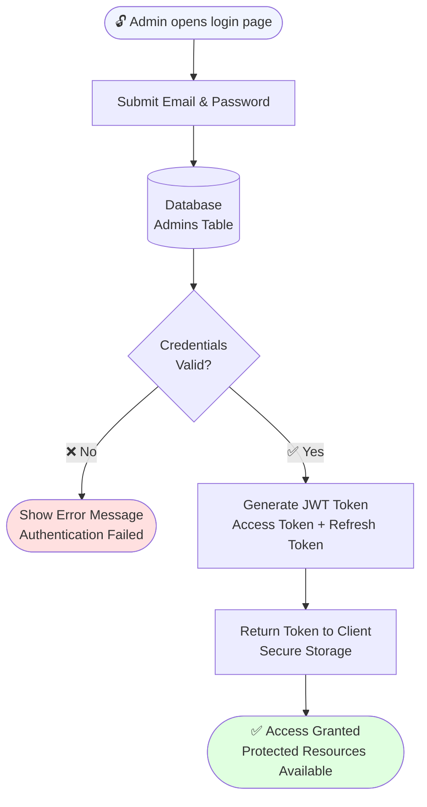
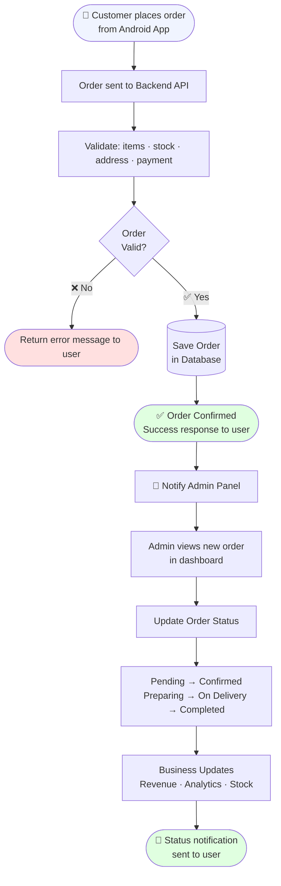

<div align="center">


# BrewBite Admin — Backend API

**RESTful backend for the administrative panel of the BrewBite café & bakery ordering platform**

[](https://www.java.com)
[](https://spring.io/projects/spring-boot)
[](https://www.postgresql.org)
[](https://jwt.io)
[](https://swagger.io)
[](LICENSE)

</div>

---

## 📌 Overview

**BrewBite Admin Backend** is the server-side engine powering the admin panel of the [BrewBite Android App](https://github.com/Melikash98/BrewBiteApp) — a full-featured ordering application for cafés and bakeries.

While the Android app handles the customer-facing experience (browsing menu, placing orders, and payment), this backend gives the **admin complete control** over the entire business operation through a clean, secure RESTful API.

The system is built around **8 independent business modules**, each handling a specific domain of the business — from authentication and product management to revenue analytics and complaint resolution.

> Built with a **security-first mindset**, the API uses JWT stateless authentication and role-based access control to ensure every endpoint is protected.

---

## 🏗️ System Architecture

<p align="center">
  
</p>

The backend follows a strict **layered architecture** that separates concerns at every level:

```text
Android App (Customer)         Admin Panel
        │                           │
        └───────────┬───────────────┘
                    ▼ HTTPS + JSON
         ┌─────────────────────┐
         │  API Gateway        │
         │  Spring Security    │
         │  JWT Filter         │
         └─────────┬───────────┘
                   ▼
         ┌─────────────────────┐
         │  Controllers        │  ← Handle HTTP Requests & Responses
         │  Services           │  ← Business Logic / Use Cases
         │  Repositories       │  ← Spring Data JPA (Data Access)
         │  Entities / Models  │  ← JPA Entities
         └──────┬──────┬───────┘
                │      │      │
         ┌──────▼─┐ ┌──▼────┐ ┌▼─────┐
         │Postgres│ │Cloud  │ │Other │
         │  SQL   │ │inary  │ │Apps  │
         └────────┘ └───────┘ └──────┘
```

**Common Modules** shared across all layers:
- Exception Handling · Validation · Logging
- Response Wrapper · Global Config · CORS Config

---

## 🔐 Authentication Flow



**Security features implemented:**

| Feature | Implementation |
|---------|----------------|
| Password Hashing | BCrypt |
| Token Type | JWT — HS256 (Stateless) |
| Access Control | Role-Based (Admin Roles) |
| Request Security | Spring Security Filter Chain |

---

## 🛒 Order Management Flow



---

## 📦 Business Modules

### 1. 🔐 Authentication
- Admin registration and secure login
- JWT access token + refresh token generation
- Role-based access control (admin-only endpoints)
- Token validation via Spring Security filter

### 2. 🍕 Item Management
- Create, update, and delete menu items
- Manage item categories (drinks / bakery)
- Upload and manage item images via Cloudinary
- Maintain item details and availability

### 3. 📋 Order Management
- View all incoming customer orders in real time
- Retrieve detailed order information and line items
- Update order status across the full lifecycle
- Track complete order history

### 4. 💰 Revenue Management
- Calculate daily and monthly income automatically
- Track cumulative total revenue
- Review transaction history in detail
- Generate structured revenue reports

### 5. ⭐ Rating & Review
- Collect ratings submitted by customers
- Calculate and expose average rating per item
- Maintain a reviewable list of ratings
- Provide rating analytics for business insight

### 6. 💬 Comments & Replies
- View all customer comments and posts
- Allow admin to reply to customer feedback
- Comment rating and management
- Moderate and manage engagement data

### 7. ⚠️ Complaint Management
- Receive and log customer complaints
- Track complaint status (open / in progress / resolved)
- Handle and resolve reported issues
- Maintain full complaint history for reference

### 8. 📊 Analytics & Reports
- Overview dashboard with business KPIs
- Sales analytics broken down by period
- User activity and behavior insights
- Combined reports and statistics across all modules

---

## 🛠️ Tech Stack

| Layer | Technology |
|-------|-----------|
| Language | Java 17 |
| Framework | Spring Boot 3.x |
| Security | Spring Security + JWT (HS256) |
| ORM | Spring Data JPA / Hibernate |
| Primary Database | PostgreSQL |
| Image Storage | Cloudinary |
| API Documentation | Swagger / OpenAPI |
| API Testing | Postman |

---

## 📁 Project Structure

```text
BrewBite-Admin/
├── src/
│   └── main/
│       ├── java/com/brewbite/admin/
│       │   ├── auth/            # JWT, login, register, security config
│       │   ├── item/            # Product CRUD & image management
│       │   ├── order/           # Order lifecycle management
│       │   ├── revenue/         # Income calculation & reports
│       │   ├── rating/          # Ratings & review analytics
│       │   ├── comment/         # Comments & admin replies
│       │   ├── complaint/       # Complaint handling & resolution
│       │   ├── analytics/       # Dashboard & statistics
│       │   └── common/          # Exception, Validation, Logging, CORS
│       └── resources/
│           └── application.properties
└── pom.xml
```

---

## ⚙️ Setup & Run

### Prerequisites
- Java 17+
- PostgreSQL running locally or remotely
- Cloudinary account (free tier works)

### 1. Clone the repository
```bash
git clone https://github.com/Melikash98/BrewBite-Admin.git
cd BrewBite-Admin
```

### 2. Configure `application.properties`
```properties
# PostgreSQL
spring.datasource.url=jdbc:postgresql://localhost:5432/brewbite_admin
spring.datasource.username=YOUR_DB_USERNAME
spring.datasource.password=YOUR_DB_PASSWORD
spring.jpa.hibernate.ddl-auto=update

# JWT
jwt.secret=YOUR_JWT_SECRET_KEY
jwt.expiration=86400000

# Cloudinary
cloudinary.cloud-name=YOUR_CLOUD_NAME
cloudinary.api-key=YOUR_API_KEY
cloudinary.api-secret=YOUR_API_SECRET
```

### 3. Run the application
```bash
./mvnw spring-boot:run
```

- API base URL: `http://localhost:8080`
- Swagger UI: `http://localhost:8080/swagger-ui.html`

---

## 🧠 Design Principles

- **Clean Architecture** — strict separation between layers
- **RESTful API Design** — consistent, predictable endpoints
- **Security-First** — every endpoint protected by default
- **Modular Development** — 8 independent, self-contained modules
- **Reusable Components** — shared validation, logging, and response wrappers
- **Scalability** — stateless JWT ready for horizontal scaling

---

## 📚 What I Learned

Developing this project gave me hands-on experience with:

- Designing **enterprise-grade REST APIs** from scratch
- Implementing **JWT authentication** with access & refresh token strategy
- Building clean, layered **Spring Boot applications** with proper separation of concerns
- **Database modeling** with JPA entities and PostgreSQL
- **Media management** with Cloudinary integration
- Structured **exception handling and validation** patterns
- Building **business analytics** and reporting workflows
- Securing APIs with **Spring Security** filter chains and role-based access

---

## 🔗 Related Repository

| Project | Description | Link |
|---------|-------------|------|
| 📱 BrewBite Android App | Customer-facing Android app — Java, Firebase, PayPal, Google Pay | [BrewBiteApp](https://github.com/Melikash98/BrewBiteApp) |

---

## 👩‍💻 Author

**Melika Shooryabi**  
Java Backend Developer · Android Developer

[](https://github.com/Melikash98)

---

## 📄 License

This project is licensed under the **MIT License**.

---

<div align="center">

Made with ❤️ — the backend layer of the BrewBite ecosystem

</div>
