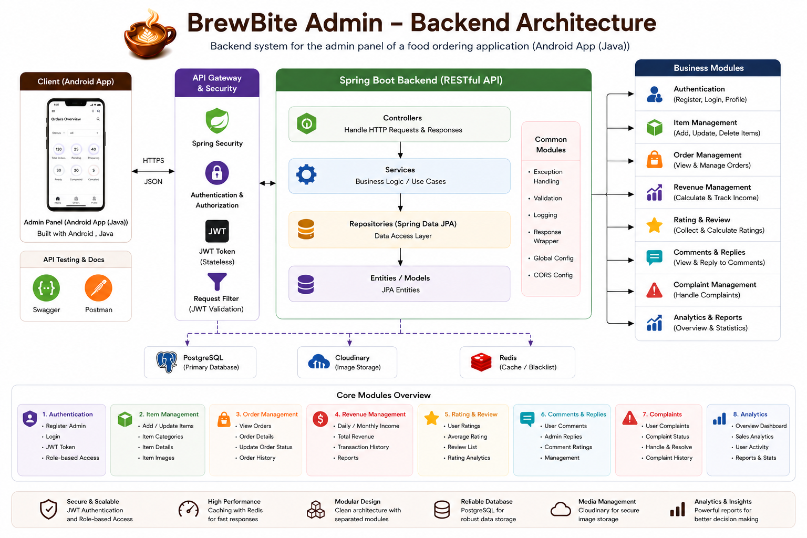

<div align="center">


# BrewBite Admin — Backend API

Backend API for the administrative panel of **BrewBite**, a café and bakery ordering platform.

[](https://www.java.com)
[](https://spring.io/projects/spring-boot)
[](https://www.postgresql.org)
[](https://cloudinary.com)
[](https://jwt.io)
[](https://swagger.io)

</div>

---

## Overview

BrewBite Admin Backend is a secure RESTful API that powers the admin panel of the BrewBite platform. It supports core business operations such as item management, order processing, revenue tracking, customer feedback, complaints, and analytics.

---

## Features

- Admin registration and login
- JWT-based authentication
- Role-based access control
- Item creation, update, and deletion
- Item category and image management
- Order viewing and status updates
- Revenue calculation and reporting
- Ratings and reviews handling
- Comments and admin replies
- Complaint tracking and resolution
- Business analytics and statistics

---

## Tech Stack

- Java 17
- Spring Boot
- Spring Security
- Spring Data JPA
- Hibernate
- JWT Authentication
- PostgreSQL
- Cloudinary
- Swagger / OpenAPI
- Postman

---

## Architecture

<p align="center">
  
</p>

The project follows a layered architecture with clear separation between controllers, services, repositories, and database access.

---

## Project Structure

```text
src/main/java/com/brewbite/admin/
├── auth
├── item
├── order
├── revenue
├── rating
├── comment
├── complaint
├── analytics
└── common
